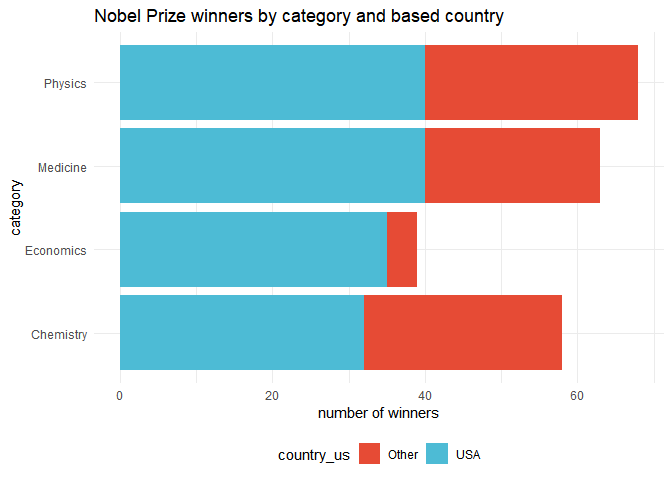
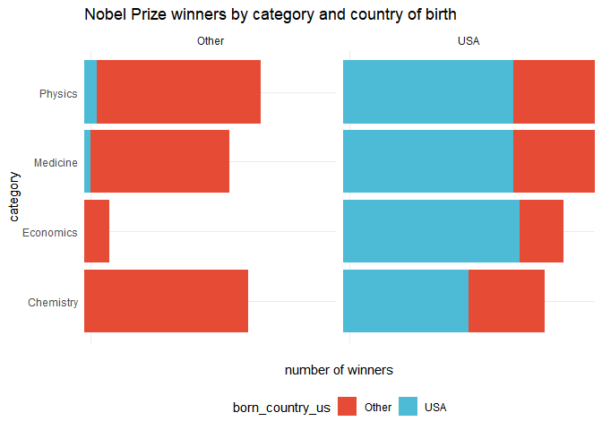

Lab 03 - Nobel laureates
================
Colin Li
1/23

### Load packages and data

``` r
library(tidyverse) 
```

``` r
nobel <- read_csv("data/nobel.csv")
```

## Exercises

### Exercise 1

``` r
summary(nobel)
```

    ##        id         firstname           surname               year     
    ##  Min.   :  1.0   Length:935         Length:935         Min.   :1901  
    ##  1st Qu.:234.5   Class :character   Class :character   1st Qu.:1947  
    ##  Median :470.0   Mode  :character   Mode  :character   Median :1976  
    ##  Mean   :475.1                                         Mean   :1970  
    ##  3rd Qu.:716.5                                         3rd Qu.:1999  
    ##  Max.   :969.0                                         Max.   :2018  
    ##                                                                      
    ##    category         affiliation            city             country         
    ##  Length:935         Length:935         Length:935         Length:935        
    ##  Class :character   Class :character   Class :character   Class :character  
    ##  Mode  :character   Mode  :character   Mode  :character   Mode  :character  
    ##                                                                             
    ##                                                                             
    ##                                                                             
    ##                                                                             
    ##    born_date            died_date             gender         
    ##  Min.   :1817-11-30   Min.   :1903-11-01   Length:935        
    ##  1st Qu.:1890-12-25   1st Qu.:1955-08-02   Class :character  
    ##  Median :1916-06-28   Median :1983-03-09   Mode  :character  
    ##  Mean   :1910-11-02   Mean   :1977-03-30                     
    ##  3rd Qu.:1935-07-10   3rd Qu.:2004-07-24                     
    ##  Max.   :1997-07-12   Max.   :2019-08-07                     
    ##  NA's   :33           NA's   :308                            
    ##   born_city         born_country       born_country_code   died_city        
    ##  Length:935         Length:935         Length:935         Length:935        
    ##  Class :character   Class :character   Class :character   Class :character  
    ##  Mode  :character   Mode  :character   Mode  :character   Mode  :character  
    ##                                                                             
    ##                                                                             
    ##                                                                             
    ##                                                                             
    ##  died_country       died_country_code  overall_motivation     share      
    ##  Length:935         Length:935         Length:935         Min.   :1.000  
    ##  Class :character   Class :character   Class :character   1st Qu.:1.000  
    ##  Mode  :character   Mode  :character   Mode  :character   Median :2.000  
    ##                                                           Mean   :1.991  
    ##                                                           3rd Qu.:3.000  
    ##                                                           Max.   :4.000  
    ##                                                                          
    ##   motivation        born_country_original born_city_original
    ##  Length:935         Length:935            Length:935        
    ##  Class :character   Class :character      Class :character  
    ##  Mode  :character   Mode  :character      Mode  :character  
    ##                                                             
    ##                                                             
    ##                                                             
    ##                                                             
    ##  died_country_original died_city_original city_original      country_original  
    ##  Length:935            Length:935         Length:935         Length:935        
    ##  Class :character      Class :character   Class :character   Class :character  
    ##  Mode  :character      Mode  :character   Mode  :character   Mode  :character  
    ##                                                                                
    ##                                                                                
    ##                                                                                
    ## 

``` r
names(nobel)
```

    ##  [1] "id"                    "firstname"             "surname"              
    ##  [4] "year"                  "category"              "affiliation"          
    ##  [7] "city"                  "country"               "born_date"            
    ## [10] "died_date"             "gender"                "born_city"            
    ## [13] "born_country"          "born_country_code"     "died_city"            
    ## [16] "died_country"          "died_country_code"     "overall_motivation"   
    ## [19] "share"                 "motivation"            "born_country_original"
    ## [22] "born_city_original"    "died_country_original" "died_city_original"   
    ## [25] "city_original"         "country_original"

``` r
glimpse(nobel)
```

    ## Rows: 935
    ## Columns: 26
    ## $ id                    <dbl> 1, 2, 3, 4, 5, 6, 6, 8, 9, 10, 11, 12, 13, 14, 1…
    ## $ firstname             <chr> "Wilhelm Conrad", "Hendrik A.", "Pieter", "Henri…
    ## $ surname               <chr> "Röntgen", "Lorentz", "Zeeman", "Becquerel", "Cu…
    ## $ year                  <dbl> 1901, 1902, 1902, 1903, 1903, 1903, 1911, 1904, …
    ## $ category              <chr> "Physics", "Physics", "Physics", "Physics", "Phy…
    ## $ affiliation           <chr> "Munich University", "Leiden University", "Amste…
    ## $ city                  <chr> "Munich", "Leiden", "Amsterdam", "Paris", "Paris…
    ## $ country               <chr> "Germany", "Netherlands", "Netherlands", "France…
    ## $ born_date             <date> 1845-03-27, 1853-07-18, 1865-05-25, 1852-12-15,…
    ## $ died_date             <date> 1923-02-10, 1928-02-04, 1943-10-09, 1908-08-25,…
    ## $ gender                <chr> "male", "male", "male", "male", "male", "female"…
    ## $ born_city             <chr> "Remscheid", "Arnhem", "Zonnemaire", "Paris", "P…
    ## $ born_country          <chr> "Germany", "Netherlands", "Netherlands", "France…
    ## $ born_country_code     <chr> "DE", "NL", "NL", "FR", "FR", "PL", "PL", "GB", …
    ## $ died_city             <chr> "Munich", NA, "Amsterdam", NA, "Paris", "Sallanc…
    ## $ died_country          <chr> "Germany", "Netherlands", "Netherlands", "France…
    ## $ died_country_code     <chr> "DE", "NL", "NL", "FR", "FR", "FR", "FR", "GB", …
    ## $ overall_motivation    <chr> NA, NA, NA, NA, NA, NA, NA, NA, NA, NA, NA, NA, …
    ## $ share                 <dbl> 1, 2, 2, 2, 4, 4, 1, 1, 1, 1, 1, 1, 2, 2, 1, 1, …
    ## $ motivation            <chr> "\"in recognition of the extraordinary services …
    ## $ born_country_original <chr> "Prussia (now Germany)", "the Netherlands", "the…
    ## $ born_city_original    <chr> "Lennep (now Remscheid)", "Arnhem", "Zonnemaire"…
    ## $ died_country_original <chr> "Germany", "the Netherlands", "the Netherlands",…
    ## $ died_city_original    <chr> "Munich", NA, "Amsterdam", NA, "Paris", "Sallanc…
    ## $ city_original         <chr> "Munich", "Leiden", "Amsterdam", "Paris", "Paris…
    ## $ country_original      <chr> "Germany", "the Netherlands", "the Netherlands",…

``` r
# 935 observations and 26 variables in the dataset. Each row is a participant
```

### Exercise 2

``` r
nobel_living <- nobel %>% 
  filter(country!="NA" & gender!="org" & is.na(died_date))

nobel_living <- nobel_living %>%
  mutate(
    country_us = if_else(country == "USA", "USA", "Other")
  )

nobel_living_science <- nobel_living %>%
  filter(category %in% c("Physics", "Medicine", "Chemistry", "Economics"))
```

### Exercise 3

``` r
library(ggsci)
ggplot(nobel_living_science, aes(x = category, fill = country_us) ) + 
geom_bar( position = "stack" ) +
coord_flip() + ylab("number of winners") +
theme_minimal() + theme( legend.position = "bottom" ) + scale_fill_npg()+ggtitle("Nobel Prize winners by category and based country")
```

<!-- -->

``` r
#"Most living Nobel laureates in the sciences are based in the US. But many of them were born in other countries." The first part of this claim is true, we can see that more USA based scientists win nobel prizes than other country based scientists. We cannot evaluate the second part of this claim because we haven't taken their birth country into account. 
```

### Exercise 4

``` r
nobel_living_science <- nobel_living_science %>%
  mutate(
    born_country_us = if_else(born_country == "USA", "USA", "Other")
  )


#105 winners were born in the U.S.
```

count(nobel_living_science\$born_country_us)

…

### Exercise 5

``` r
ggplot(nobel_living_science, aes(x = category, y = "", fill = born_country_us) )    + facet_wrap(~ country_us) + 
geom_bar( stat = "identity", position = "stack" ) +
coord_flip() + ylab("number of winners") +
theme_minimal() + theme( legend.position = "bottom" ) + scale_fill_npg()+ggtitle("Nobel Prize winners by category and country of birth")
```

<!-- -->

``` r
#Based on your visualization, do the data appear to support Buzzfeed’s claim? I would still say yes. The majority of USA winners are U.S. born (which is not surprising), but there is a certain number of foreign born winners in each category. So we could say that immigration is important to  science. 
```

…

### Exercise 6

``` r
#for science prizes only
nobel_living_science %>% 
  filter(country=="USA" & born_country!="USA") %>% select(born_country) %>% group_by(born_country) %>% dplyr::count(sort = TRUE)
```

    ## # A tibble: 21 × 2
    ## # Groups:   born_country [21]
    ##    born_country       n
    ##    <chr>          <int>
    ##  1 Germany            7
    ##  2 United Kingdom     7
    ##  3 China              5
    ##  4 Canada             4
    ##  5 Japan              3
    ##  6 Australia          2
    ##  7 Israel             2
    ##  8 Norway             2
    ##  9 Austria            1
    ## 10 Finland            1
    ## # … with 11 more rows

…
